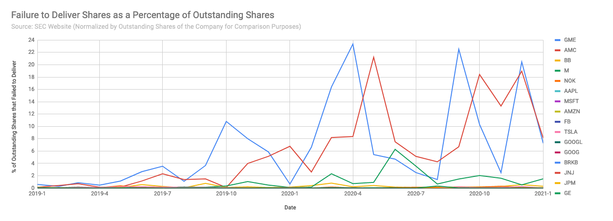

# Evidence of Massive Naked Short Selling Fraud in GME and AMC

First of all, major credit to u/johnnydaggers for the [original DD](https://www.reddit.com/r/wallstreetbets/comments/l97ykd/the_real_reason_wall_street_is_terrified_of_the/)
If you haven't read that yet, go take a look.

Inspired by his analysis, I wanted to investigate the SEC's publicly available
Failed to Deliver data and see how it compared to other companies over time.

I wrote some code to process the the raw SEC data and normalize the shares that
failed to deliver by the total number of outstanding shares of the company. This
gives us a view that is the total percent of outstanding shares that failed to
deliver each month, so we can fairly compare companies to one another.

I went back to the beginning of 2019, looking at a few of the recent meme
stocks with short squeezes as well as the top 10 (by weight) in the S&P 500 as
well as GE (as an example of a stock with very low short interest). Here's what
I found.

