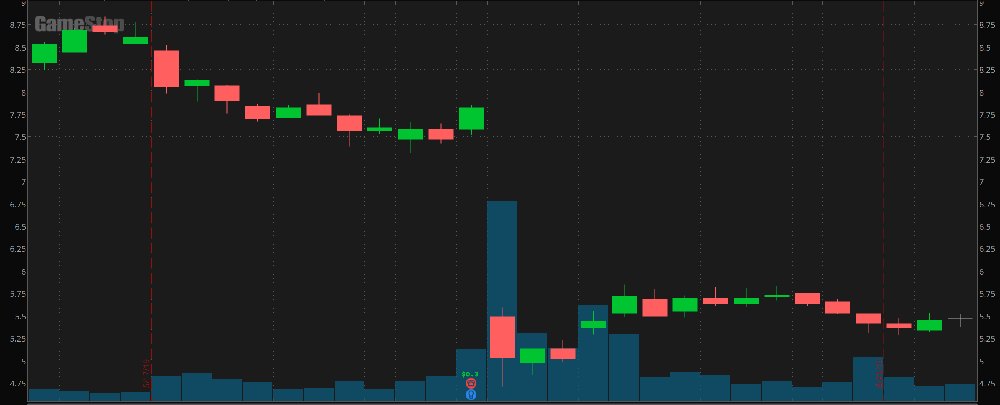
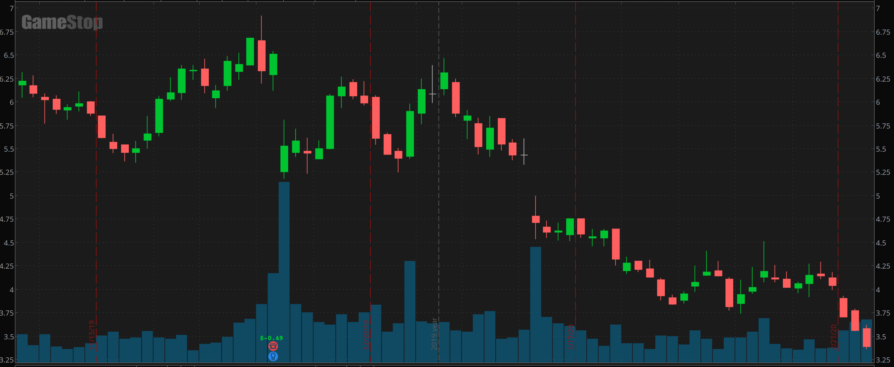

# Evidence of Massive Naked Short Selling Fraud in GME and AMC

First of all, major credit to u/johnnydaggers for the [original DD](https://www.reddit.com/r/wallstreetbets/comments/l97ykd/the_real_reason_wall_street_is_terrified_of_the/)
If you haven't read that yet, go take a look.

Inspired by his analysis, I wanted to investigate the SEC's publicly available
Failed to Deliver data and see how it compared to other companies over time.

I wrote some code to process the the raw SEC data and normalize the shares that
failed to deliver by the total number of outstanding shares of the company. This
gives us a view that where each company's FTD shares are expressed as a percentage
of the outstanding, so we can fairly compare companies to one another.

(Before you ask, yes I account for fluctuating values of outstanding shares.)

I went back to the beginning of 2019, looking at a few of the recent meme
stocks with short squeezes as well as the top 10 (by weight) in the S&P 500 as
well as GE (as an example of a stock with very low short interest). Here's what
I found.

Shares can fail to deliver for many reasons, but when large numbers of shares
fail to deliver a likely explanation is naked short selling. For a thorough
explanation of this, see [this article](http://counterfeitingstock.com/CS2.0/CounterfeitingStock.html).

Back in early 2019, both GME and AMC look like the others. All had sub-1% of
their outstandinding shares end up as FTD. But starting in mid 2019, both GME
and AMC experienced three waves of progressively larger naked short selling
attacks. This is known as [scaling in](https://www.investopedia.com/terms/s/scale-in.asp).

I wanted to see if I could find corroborating evidence of news and price data
which aligned in time with these waves of naked shorting. What I found were
two stories, both similar, explaining how GME and AMC got to where they are
today.

## GameStop

The first wave (small bet) of naked shorts occurred in June and July of 2019.
GME reported Q1 '19 earnings on June 4th after hours, with a [bleak future outlook](https://www.washingtonpost.com/business/2019/06/05/gamestop-stock-plunges-nearly-percent-gamers-brace-new-era-consoles/).
Overall sales was down $1.5B, net income plunged by 78%. This story is what
formed the core of the bear thesis. The stock dropped 36% on the news.

But things changed when Q2 '19 earnings came around. Yes, sales were down again
and the numbers didn't look good, but the company announced it was going to
[reboot with a major strategic update](https://www.globenewswire.com/news-release/2019/09/10/1913815/0/en/GameStop-Reports-Second-Quarter-Fiscal-2019-Results.html).
They were going to make their retail stores more efficient by closing some
locations, focus on becoming a social hub for gaming, and build a digital
platform around the relaunched GameStop website.

Investors liked the news and the stock tries to move upwards, but is repeatedly
beaten down. This lines up with the second wave of naked shorting. The original
short sellers couldn't let the price float up, so they resorted to more than
doubling down on their original naked short bet to keep the stock trending
downward.

## AMC Entertainment
